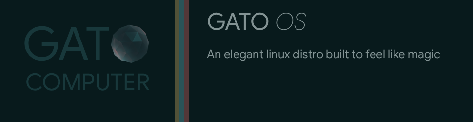

# Gato OS

An elegant WIP distro that will feel like magic. Currently? just half-vibecoded slop from hell while I focus more on the general direction I want + I learn everything I need to to make this a reality.

## Installation

1. Install [Fedora COSMIC Atomic](https://fedoraproject.org/atomic-desktops/cosmic/)
2. Rebase to Gato OS:
    ```bash
    rpm-ostree rebase ostree-unverified-registry:ghcr.io/DCCXXV/gato-os:latest
    systemctl reboot
    ```

## Features

### Intelligent Folders

Make any folder automatically process files dropped into it:

```bash
# Compress images (default)
gato f a ~/Photos -k

# Convert videos to MP4
gato f a ~/Videos -a convert-mp4

# Custom command
gato f a ~/Resize -c 'convert {} -resize 50% {}'

# List configured folders
gato f ls

# Remove
gato f rm ~/Photos
```

This will have a GUI too.

### TO BE DONE

- Auto convert files when changing the extension from anywhere
- Ghost commands (if the program is not installed run it will run it in an ephemereal container)
- First class integration with syncthing
- Small QOL changes for developers (like detecting when you are trying to run something on an used port and launching a cosmic notification telling you which program is using it and more)
- (very in the future) an android app that merges the functionality of syncthing and kdeconnect.

**Shortcuts:**

- `gato f` = `gato folder`
- `a` = `add`, `rm` = `remove`, `ls` = `list`
- `-a` = `--action`, `-c` = `--cmd`, `-k` = `--keep-original`, `-e` = `--ext`

**Actions:**

- `compress` - Compress images (PNG, JPG, WebP)
- `convert-webp` - Convert to WebP
- `convert-mp4` - Convert videos to MP4
- `convert-mp3` - Convert audio to MP3
- `resize-50` / `resize-25` - Resize images

## Apps

- **Browser**: Helium
- **Editor**: Zed
- **Media**: VLC, Loupe
- **Theme**: Gato Dark (COSMIC)

## Building

```bash
bluebuild build --build-driver podman --inspect-driver podman --run-driver podman recipe.yml
```

## License

MIT
